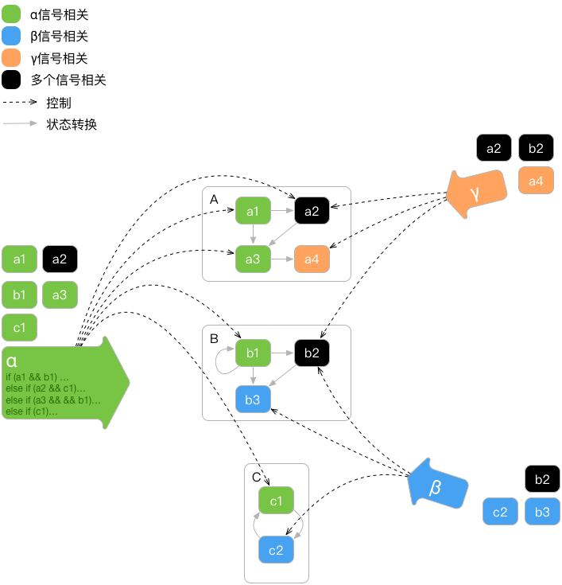
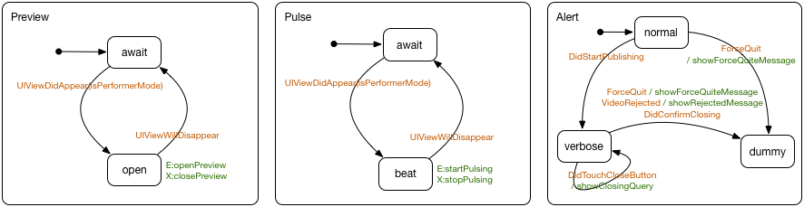

# SDDKit - State Driven Development Kit
A visual way of impletementing UI / Complex systems

## 一、传统编程方法的固有问题和挑战
传统方法是由信号驱动，并在某个信号处理方法中对各个业务组件状态进行判别与调整的过程，如下图。当A组件遇到α事件时，α事件的处理方法必须判断A、B、C三个组件各自的当前状态，然后执行对应的业务方法。（略……）


## Tasks

### 阶段一：概念验证与展示
- [x] DSL图示
- [x] 状态监控（本文）
- [x] 复盘
- [x] 状态监控（截图）Tasks
- [x] 行为模拟
- [ ] 逻辑下发

### 阶段二：
- [ ] 图形化状态机呈现

- [ ] 丰富历史分析手段
	- [ ] 只看某个状态的相关历史
	- [ ] 查看选中的几个状态的相关历史
	- [ ] 只看某个事件引发的相关反应
- [ ] 行为上报策略优化
	- [ ] 避免导致界面卡顿（异步发送）
	- [ ] 节省网络流量（协议优化）
	- [ ] 降低通信失败概率（批次发送）
- [ ] 更多语义支持
	- [ ] 子系统正交语义
	- [ ] 历史状态选择器
	- [ ] 命名分支选择器
- [ ] Objective-C Library 增强
	- [ ] 对标准控件的事件简化触发支持
    ```objective-c
    		_btn.sdd_trigger(TouchUpInside, @"DidTouchButton");
    ```
	- [ ] 时间触发器的支持
    ```objective-c
    		domain.sdd_trigger_after(3, @"EventAfter3Seconds");
            domain.sdd_trigger_periodically(1, @"EventEvery1Second");
            // 其它
    ```
	- [ ] 标准控件的内置DSL操作方法支持，如hide(ctrl)
	- [ ] …… Use your imagination ……
- [ ] 日志本地化备份与加载分析
- [ ] Playground对同一个客户端支持多个命名空间（域）的支持
- [ ] Playground支持多个客户端连接
